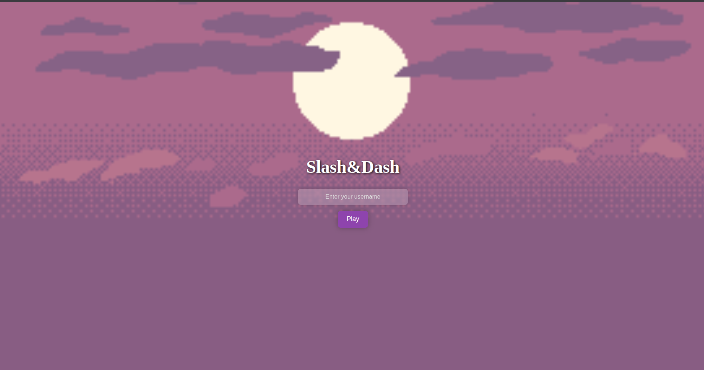
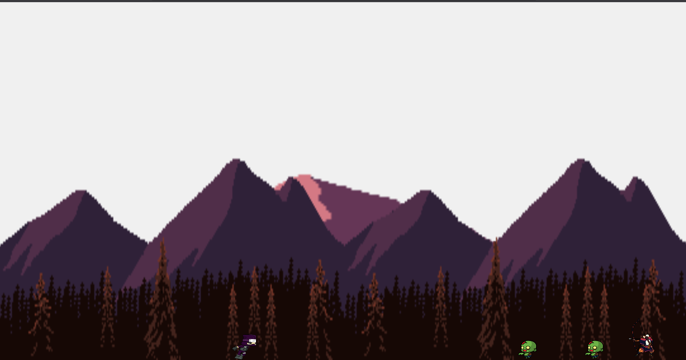
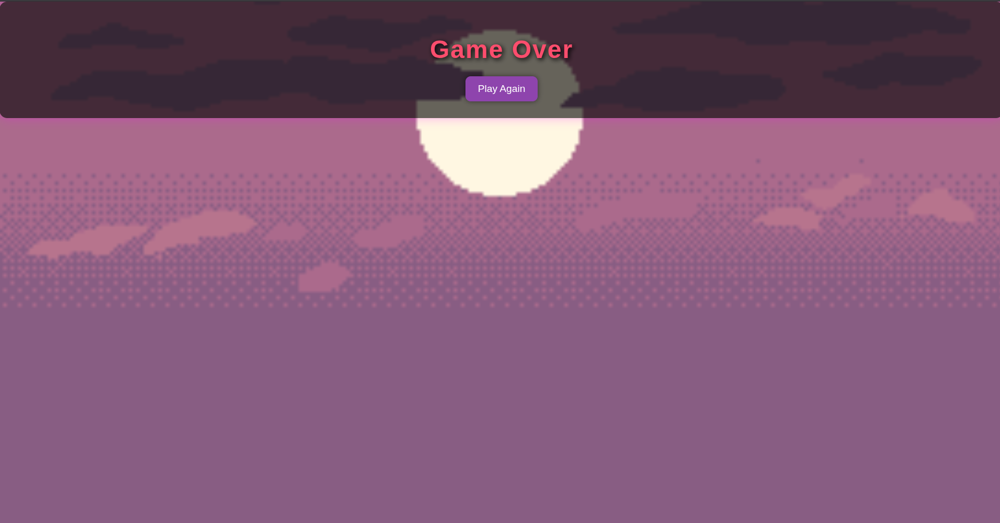

# 🎮 First Project - JS Game

A browser-based JavaScript game built with **vanilla JavaScript**, HTML, and CSS to learn the basics of **web development** and **game development**.

---

## 🎥 GIF Demo


---

## 📸 Screenshots
**Start Screen**  


**Gameplay**  


**Game Over**  


---

## 📝 Overview

This project was my **final year project** for my first year in school. I chose a game inspired by the **classic Mario game**, focusing on learning **game logic, event handling, and animations**.

---

## 🚀 Features
- 🕹️ Player movement  
- 🌄 Parallax background  
- 🏁 Starting page and game over page  
- 👾 Enemy elimination  

---

## 🛠️ Tech Used
- 💻 JavaScript  
- 🌐 HTML  
- 🎨 CSS  

---

## 📚 What I Learned
- JavaScript fundamentals  
- Game loop & logic  
- Organizing code cleanly  
- Debugging techniques  
- Parallax backgrounds  
- Animating with sprite sheets  
- Handling events efficiently  

---

## 📦 How to Run

1. Clone the repository:
```bash
git clone https://github.com/Walid-SEC/first-project-js-game-.git
